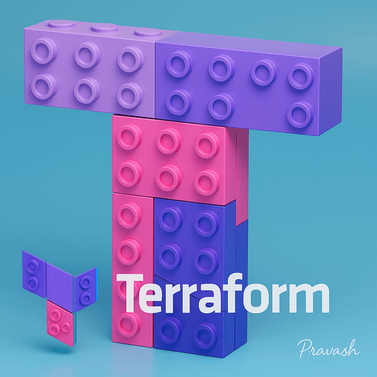
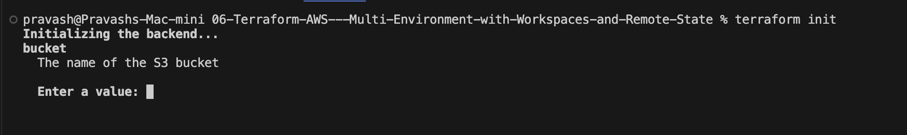
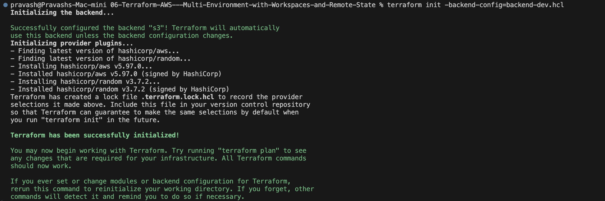
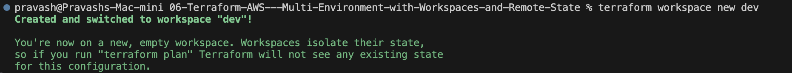
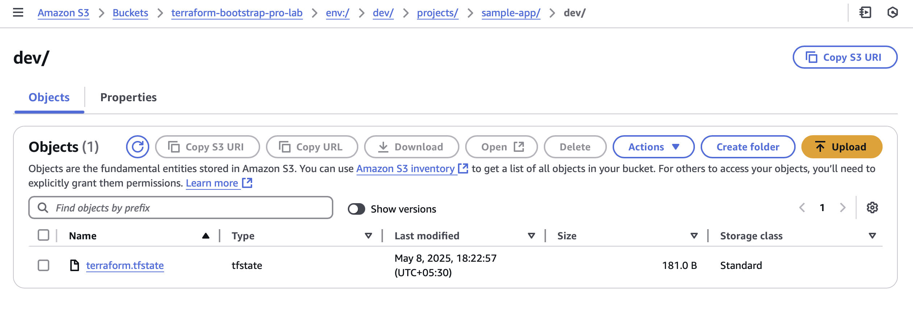
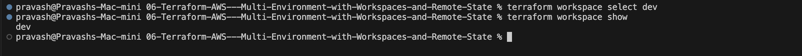
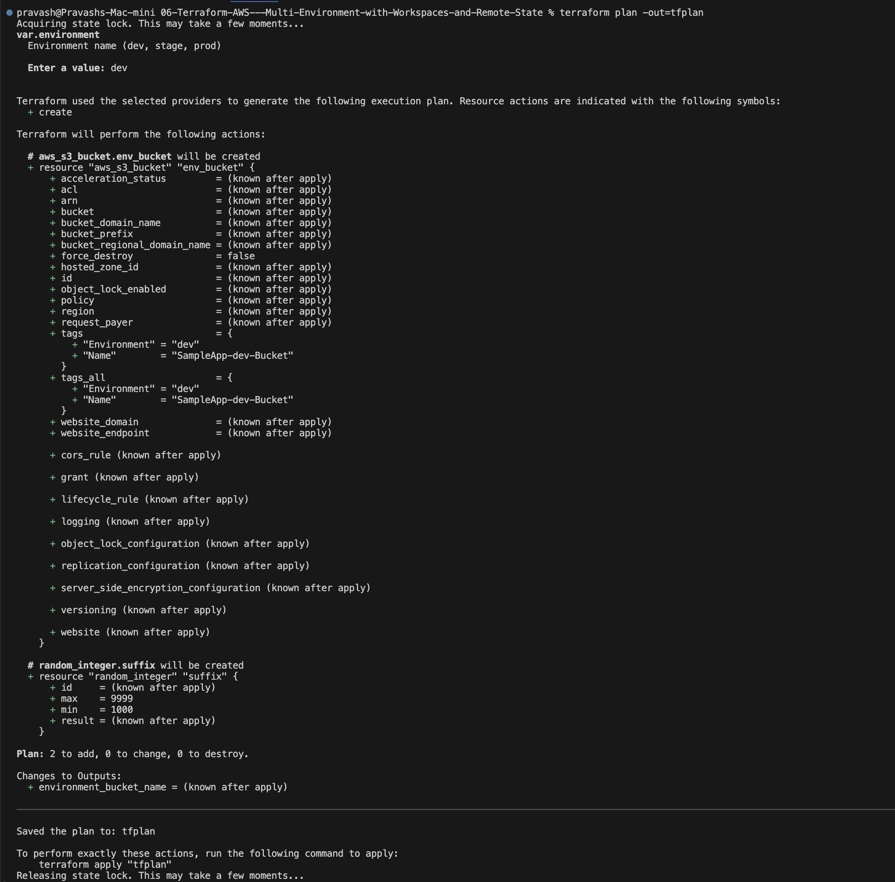
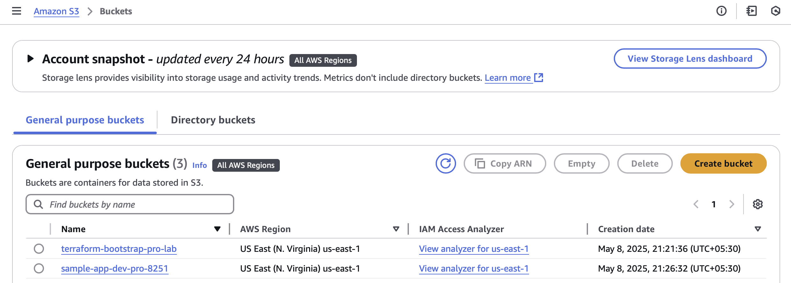
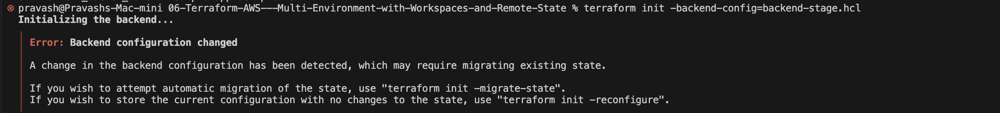

# 06-Terraform-AWS---Multi-Environment-with-Workspaces-and-Remote-State
In this lab, I'll walk you through How Large Organizations deploy infrastructure across environments safely..



## Objective
> In this lab, I'll show you How to:
    > - Use **Terraform Workspaces**** to manage multiple environments (dev, stage, prod).
    > - Separate **Terraform state files** per environment.
    > - Avoid conflicts and messy management.
    > - Follow real-world best practices for environment isolation.


## Before We move further, let's first refresh few basic Topics that are relevant to this Lab.
1. We know what is a **Terraform State** and **Remote State**

2. Why do we need **Multiple Environments?**
- > In real projects, we usually have **dev, stage & prod** environments.
- > Each environment should have it's own resources.
- > They should've their own **Terraform state** so that changes in DEV don't break PROD.

3. What are Workspaces?
- > Terraform workspaces lets us:
  > - Use the same **code**,
  > - But switch between **different environments** (like dev, state, prod),
  > - Each workspace has it's **own state file**

## Pre-requisites
- Completed 05-Terraform-AWS---Remote-State-Team-Collaboration-and-State-Locking lab.

- Remote backend (S3 + DynamoDB) already set up:

    - S3 bucket: terraform-bootstrap-pro-lab

    - DynamoDB table: terraform-lock-pro-lab

- Terraform Installed

- AWS CLI Configured

## Folder Structure
**In this lab, I'm going to use Single set of `.tf` files as I will use WORKSPACES to handle multiple environments dynamically.**

```
06-Terraform-AWS---Multi-Environment-with-Workspaces-and-Remote-State/
├── backend.tf
├── backend-dev.hcl
├── backend-stage.hcl
├── backend-prod.hcl
├── main.tf
├── outputs.tf
├── provider.tf
├── terraform.tfvars
├── variables.tf
└── README.md
```

## backend.tf
```
terraform {
    backend "s3" {}
}
```
**Explaination:**
- Here I'm defining the backend type (s3) for storing state.
- I'm leaving the details (bucket, key etc.) empty here, because I'll pass them via external files (-backend-config) when running `terraform init`.
- This way, I'm avoiding hardcoding the values, so that it works across all environments.

## backend-dev.hcl
```
bucket         = "terraform-bootstrap-pro-lab"
key            = "projects/sample-app/dev/terraform.tfstate"
region         = "us-east-1"
dynamodb_table = "terraform-lock-pro-lab"
encrypt        = true
```
**Explaination:**
- Here I'm telling terraform where to store the **state file** (`terraform.tfstate`) for the `dev` environment.
- It will use the previously bootstrapped s3 bucket ("terraform-bootstrap-pro-lab")
- `key` -> acts like a **Folder Path** inside the S3 bucket.
- `dynamodb_table` -> enables **state locking** to prevent team conficts.
- I'll create similar `.hcl` files for `stage` & `prod`.

## backend-stage.hcl
```
bucket         = "terraform-bootstrap-pro-lab"
key            = "projects/sample-app/stage/terraform.tfstate"
region         = "us-east-1"
dynamodb_table = "terraform-lock-pro-lab"
encrypt        = true
```

## backend-prod.hcl
```
bucket         = "terraform-bootstrap-pro-lab"
key            = "projects/sample-app/prod/terraform.tfstate"
region         = "us-east-1"
dynamodb_table = "terraform-lock-pro-lab"
encrypt        = true
```

## provider.tf
```
provider "aws" {
    region = var.aws_region
}
```
**Explaination:**
- This tell terraform which cloud provider to talk to. (AWS in this case)
- I'm using a variable (`var.aws_region`) for flexibility.

## variables.tf
```
variable "aws_region" {
  description = "AWS region"
  type        = string
  default     = "us-east-1"
}

variable "environment" {
  description = "Environment name (dev, stage, prod)"
  type        = string
}
```
**Explaination:**
- Here I've defined the variables Terraform will use.
- I've hardcoded the region here but I'll **pass environment name** at *runtime*.

## terraform.tfvars
```
aws_region = "us-east-1"
```
**Explaination:**
- I'm passing the default value for this region.
- As we know, Terraform automatically loads this file.

## main.tf
**Explaination:**
- I'm going to create a **unique S3 bucket** per environment.
- Also, I'm going to use the **resource block** `random_integer` to avoid name conflicts.
- I'll apply environment-specific tags (As a good practice).

```
resource "random_integer" "suffix" {
  min = 1000
  max = 9999
}

resource "aws_s3_bucket" "env_bucket" {
  bucket = "sample-app-${var.environment}-pro-${random_integer.suffix.result}"

  tags = {
    Name        = "SampleApp-${var.environment}-Bucket"
    Environment = var.environment
  }
}
```

## outputs.tf
**Explaination:**
- Now, I'm going to print the created bucket name after `terraform apply`.
- The value will be based on the **resource type and resource name** from `main.tf` file.
```
output "environment_bucket_name" {
    description = "The name of the created S3 bucket"
    value       = aws_s3_bucket.env_bucket.id
}
```

## Let's Run this Lab

1. If I run `terraform init`:


    > I'm being asked to enter the value for S3 bucket. However, I've already passed these details in the backend-dev/prod/stage.hcl files. So, I need to call the file (backend-dev.hcl or backend-stage.hcl or backend-prod.hcl) while initializing terraform.

    **Let's try again!!**

2. Let's initialize but with a modification.

    `terraform init -backend-config=backend-dev.hcl`

    
    > This is now successfully initialized. So, We're good for next steps.

3. Now, I'm going to create the `dev` workspace:
    `terraform workspace new dev`
    
    >We can also see the path in S3.

    
4. Let's now select the `dev` workspace so that we can create the new S3 bucket inside that environment.
    

5. Now, Let's run the `terraform plan` command:

    `terraform plan -out=tfplan`

    > It will ask to enter a value for the Environment name (dev, stage or prod). Let's put `dev` and enter.

    

    > As We can see, it has created a terraform plan and is available in the tfplan file.

6. Let's now apply this file.

    `terraform apply tfplan`

    

    > Awesome!! I can now see the apply was successful and the terraform bucket (`sample-app-dev-pro-5779) is also created by validating the AWS Account.

    


## Let's now Move to **Staging** Environment and create the same:

1. Let's initialize.

    `terraform init -backend-config=backend-stage.hcl`

    

    > OOPS!! We faced this error. We'll understand what is this error and how can we fix this?